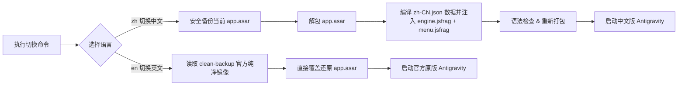

# Antigravity 简体中文语言切换补丁 (antigravity-zh)

<p align="center">
  <b>一键为 Google Antigravity 桌面端启用高品质简体中文界面，支持随时秒级切换回官方原版英文。</b><br>
  <i>One-command Simplified Chinese localization & switcher for Antigravity desktop app.</i>
</p>

<p align="center">
  
  
  
</p>

---

## ✨ 项目特性

- 🚀 **一行命令自由切换**：一行命令即可在**简体中文**与**官方原版英文**之间秒级切换。
- 🖥️ **全平台支持**：原生支持 **Windows** 与 **Linux**（同时兼容 macOS）。
- 🛡️ **安全无损与干净备份**：首次运行时自动生成 `app.asar.clean-backup` 官方原始镜像，支持 100% 零残留还原。
- ⚡ **响应式 DOM 动态引擎**：基于 `MutationObserver` 与 `TreeWalker`，完美适配 React 动态渲染、路由切换、抽屉弹窗及长句超链接分割。
- 🌐 **数据驱动架构（Data-Driven）**：翻译引擎与语言数据彻底解耦，词条、动态正则与标点映射统一由 `src/locales/zh-CN.json` 维护，支持 Schema 语法校验。
- 🔒 **纯净安全**：不触碰底层二进制执行文件，不拦截任何模型对话、Token 与网络请求；代码编辑区（Monaco/xterm）严格隔离。
- 🧩 **动态模式识别**：自动转换思考耗时（`Thought for Xs`）、限额倒计时、任务状态统计等动态信息。
- 💾 **优雅关闭优先**：切换前先请求 Antigravity 正常退出并等待其保存状态，仅在超时仍未退出时才强制结束（可用 `--force` 跳过等待）。
- 🧭 **可靠状态记录**：切换结果写入 `antigravity-zh-state.json`，`status` 命令完整扫描归档判定当前语言，自动感知官方更新覆盖。

---

## 🚀 快速上手 (Quick Start)

> [!NOTE]
> 在执行切换命令前，请确保系统已安装 [Node.js](https://nodejs.org/) (>= 16)。

### 方式一：源码直接运行（推荐）

```bash
# 1. 克隆本仓库到本地
git clone https://github.com/wade19990814-hue/antigravity-zh.git
cd antigravity-zh

# 2. 安装依赖 (仅包含官方 @electron/asar 打包工具)
npm install

# 3. 一键切换为简体中文
node bin/cli.js zh

# 4. 随时一键切换回官方英文原版
node bin/cli.js en

# 5. 查看当前语言与安装路径状态
node bin/cli.js status
```

---

### 方式二：本地全局命令注册 (npm link)

在项目目录下执行 `npm link`，即可在系统任意终端路径直接使用全局 `antigravity-zh` 命令：

```bash
antigravity-zh zh        # 切换为中文
antigravity-zh en        # 切换回英文
antigravity-zh status    # 查看状态
```

---

## ⚙️ 命令行参数说明

```text
Usage:
  node bin/cli.js <command> [options]
  antigravity-zh <command> [options]

Commands:
  zh                切换为简体中文 (Simplified Chinese)
  en                还原官方原版英文 (Official English)
  status            查看当前安装路径、语言状态与备份状态

Options:
  --app-dir <path>  自定义 Antigravity 安装目录（未安装在默认路径时使用）
  --locale <code>   指定语言包（默认: zh-CN）
  --no-restart      补丁完成后不自动重启应用
  --no-kill         不主动关闭 Antigravity（请自行先关闭应用）
  --force           跳过优雅关闭等待，立即强制结束 Antigravity
  -h, --help        查看帮助信息
  -v, --version     查看版本号
```

---

## 🛠️ 工作原理



---

## 📂 项目结构

```text
antigravity-zh/
├── bin/
│   └── cli.js                    # 跨平台 Node.js CLI 命令行入口
├── src/
│   ├── index.js                  # 核心补丁注入与一键还原调度引擎
│   ├── detector.js               # 跨平台路径探测与进程管理 (Windows/Linux/macOS)
│   ├── locale.js                 # 语言包加载、校验与片段编译
│   ├── locales/
│   │   ├── zh-CN.json            # 简体中文语言数据 (词典/动态规则/标点)
│   │   └── locale.schema.json    # 语言包 JSON Schema 契约定义
│   └── patches/
│       ├── engine.jsfrag         # 语言中立的 DOM 动态翻译引擎模板
│       └── menu.jsfrag           # 语言中立的原生菜单翻译模板
├── test/
│   ├── locale.test.js            # 语言包数据与引擎核心校验
│   ├── dom.test.js               # DOM 遍历与 MutationObserver 注入测试
│   └── inject.test.js            # 补丁注入幂等性校验（重复执行不叠加）
├── package.json                  # 项目配置
├── README.md                     # 项目说明文档
├── CONTRIBUTING.md               # 词条贡献指南
├── LICENSE                       # MIT 许可证
└── .gitignore                    # Git 忽略规则
```

---

## 🤝 参与贡献与增补词条

发现有新的界面未被翻译？直接在语言数据文件中添加即可：

1. 打开 [`src/locales/zh-CN.json`](./src/locales/zh-CN.json)
2. 在 `"text"` 字典中添加中英对照：
   ```json
   "Original Text": "中文翻译"
   ```
3. 运行测试确保语法和格式无误：
   ```bash
   npm test
   ```
4. 详见 [CONTRIBUTING.md](./CONTRIBUTING.md)。

---

## ⚠️ 免责声明 (Disclaimer)

1. 本项目为第三方本地化工具，与 Google 公司无官方关联。
2. 本工具仅对客户端前端界面进行语言渲染层修补，不修改任何核心请求、隐私数据与业务逻辑。
3. 使用本项目所产生的任何风险由使用者自行承担。

---

## 📄 开源许可证

本项目基于 [MIT License](./LICENSE) 协议。
